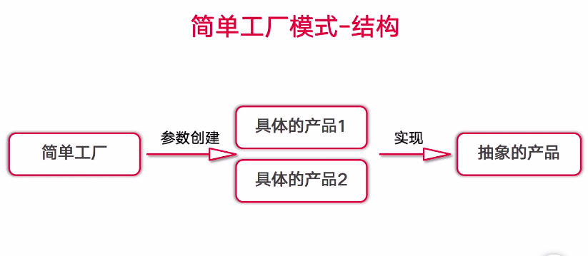
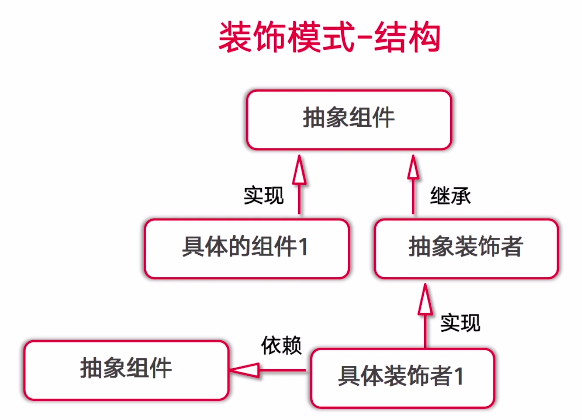

# design-mode
develop design mode as golang

### 简单工厂模式
- 属于创建型模式，又叫做静态工厂方法模式 Static Factory Method
- 可以根据参数的不同返回不同类的实例
- 专门定义一个类来负责创建其他类的实例，被创建的实例通常都具有共同的父类

- 优点：实现了解耦
- 缺点：违背了“开闭原则”
- 适合：创建的对象比较少

### 工厂方法模式
- 又称为工厂模式，也叫虚拟构造器模式或者多态工厂模式，属于类创建型模式
- 工厂父类负责定义创建产品对象的公共接口，工厂子类则负责生成具体的产品对象

- 开闭原则：在面向对象编程领域，规定“软件中的对象（类，模块，函数等等）应该对于扩展是开放的，但是对于修改是封闭的

- 优点：实现了解耦，遵守了开闭原则
- 缺点：在添加新类型的时候，在一定程度上增加了系统的复杂度
- 适合：创建类的时候不需要知道具体的类名称，只需要知道其所对应的工厂方法

### 装饰模式
- 一种动态地往一个类中添加新行为的设计模式
- 装饰模式相比生成子类更为灵活，可以只给某个对象而不是整个类添加一些功能
- 它是一种对象结构型模式

- 优点：
- 可以通过一种动态的方式来扩展一个类的功能；
- 可以使用多个具体装饰类来装饰同一个类，增加其功能
- 具体组件类与具体装饰类可以独立变化，符合“开闭原则”
- 缺点：
- 对于多次装饰的对象，容易出错，排错相对困难
- 产生很多具体的装饰类，增加了系统的复杂度以及理解成本
- 适合场景：
- 需要给一个对象增加功能，这些功能可以动态地撤销
- 需要给一批兄弟类增加或者改装功能

