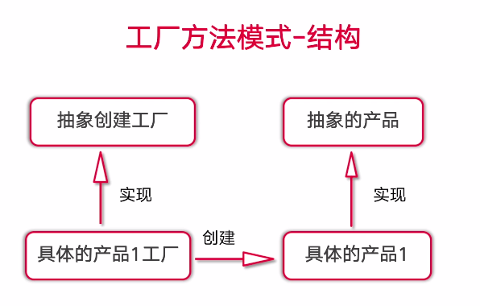

# design-mode
develop design mode as golang

### 简单工厂模式
- 属于创建型模式，又叫做静态工厂方法模式 Static Factory Method
- 可以根据参数的不同返回不同类的实例
- 专门定义一个类来负责创建其他类的实例，被创建的实例通常都具有共同的父类

- 优点：实现了解耦
- 缺点：违背了“开闭原则”
- 适合：创建的对象比较少

### 工厂方法模式
- 又称为工厂模式，也叫虚拟构造器模式或者多态工厂模式，属于类创建型模式
- 工厂父类负责定义创建产品对象的公共接口，工厂子类则负责生成具体的产品对象

- 开闭原则：在面向对象编程领域，规定“软件中的对象（类，模块，函数等等）应该对于扩展是开放的，但是对于修改是封闭的

- 优点：实现了解耦，遵守了开闭原则
- 缺点：在添加新类型的时候，在一定程度上增加了系统的复杂度
- 适合：创建类的时候不需要知道具体的类名称，只需要知道其所对应的工厂方法